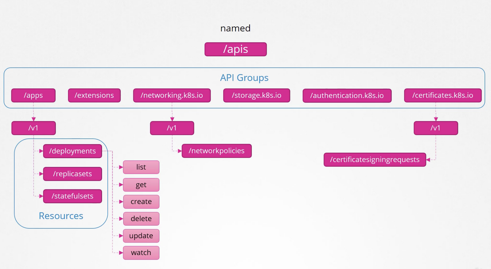

- Default port for API server 6443

## Groups

- APIs are categorized into different groups -
    - metrics
    - health
    - version
    - logs - used for integrating third party logging applications
    - api - **Core**
    - apis - **Named**

### API

- The core group is where all core functionality exists such as namespaces, pods, replication controllers, events and points, notes, bindings, persistent volumes, persistent volume claims, conflict maps, secrets, services, et cetera.  
    

### APIs

- The named group APIs are more organized. And going forward, all the newer features are going to be made available through these named groups.
- Within apps, you have deployments, replica sets, StateFul sets. Within networking, you have network policies. Certificates have these certificate signing requests that we talked about earlier in this section. So the ones at the top are API groups, and the ones at the bottom are resources in those groups. Each resource in this has a set of actions associated with them. Things that you can do with these resources, such as list the deployments, get information about one of these deployments, create a deployment, delete a deployment, update a deployment, watch a deployment, et cetera. These are known as **verbs**.  
    

## Accessing API

Before using below command you will need to authenticate

```bash
curl http://localhost:6443 -k
```

### Authentication

```bash
curl http://localhost:6443 -k --key admin.key --cert admin.crt --cacert ca.crt
```

- To avoid authentication you can start kubectl proxy which indirectly uses those certificates.
    - `kubectl proxy`
    - Kubectl proxy is an http proxy service created by Kube control utility to access the Kube API server.
    - This starts proxy server at port `8001`
    -  qAccess - `curl http://localhost:8001 -k`
    - The proxy will use the credentials from Kube config file to forward your request to the Kube API server.