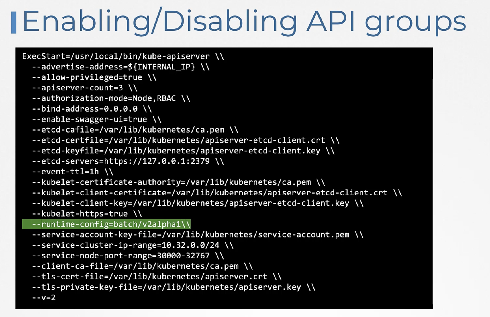

# Patch versions : X.Y.Z
Where X stands for major, Y stands for minor and Z stands for patch version.

# Enabling/Disabling aplha versions
- So to enable or disable a specific version you must add it to the `runtime-config` parameter of the Kube API server service.

## Example -
- As a good practice, take a backup of that apiserver manifest file before going to make any changes.
```
 root@controlplane:~# cp -v /etc/kubernetes/manifests/kube-apiserver.yaml /root/kube-apiserver.yaml.backup 
```

# Kubectl convert
- So to convert my YAML files to newer version you may use the cube cuttle convert command and specify the old yamo file and the new output format.
- Example, `kubectl convert -f <old-file> --output-version <new-api>`
- `kubectl convert -f old-file.yaml --output-version apps/v1`


## Identifying the short names of the deployments, replicasets, cronjobs and customresourcedefinitions etc
```
$ kubectl api-resources
```

## Finding API group of a resource
```
controlplane ~ ➜  kubectl explain job | grep -i group
GROUP:      batch
```

## To identify the preferred version
- For example, preferred version for authorization.k8s.io api group can be found using below command
```
root@controlplane:~# kubectl proxy 8001&
root@controlplane:~# curl localhost:8001/apis/authorization.k8s.io
```
Where & runs the command in the background and kubectl proxy command starts the proxy to the kubernetes API server.