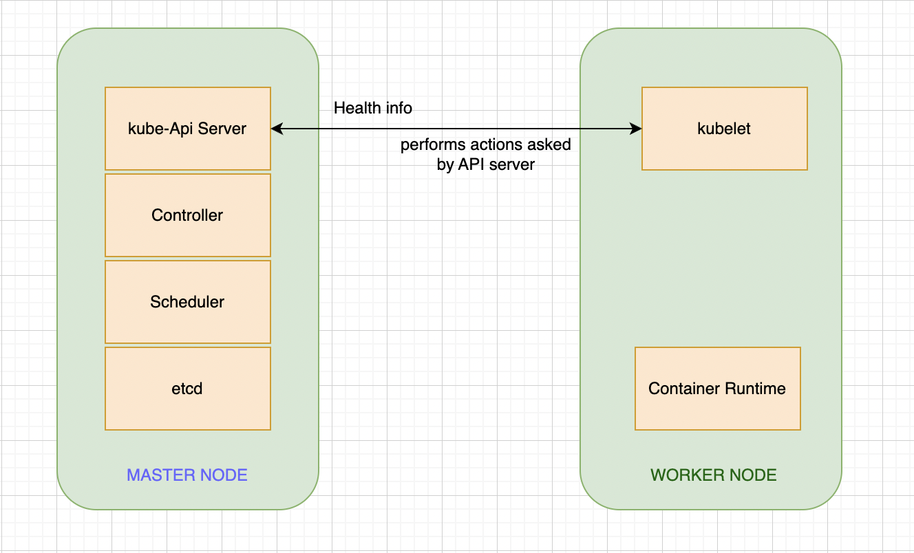
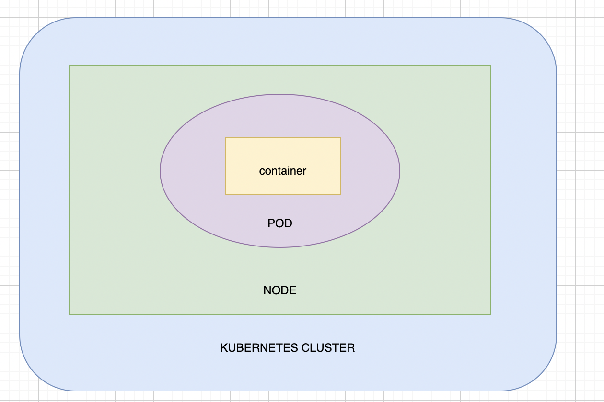
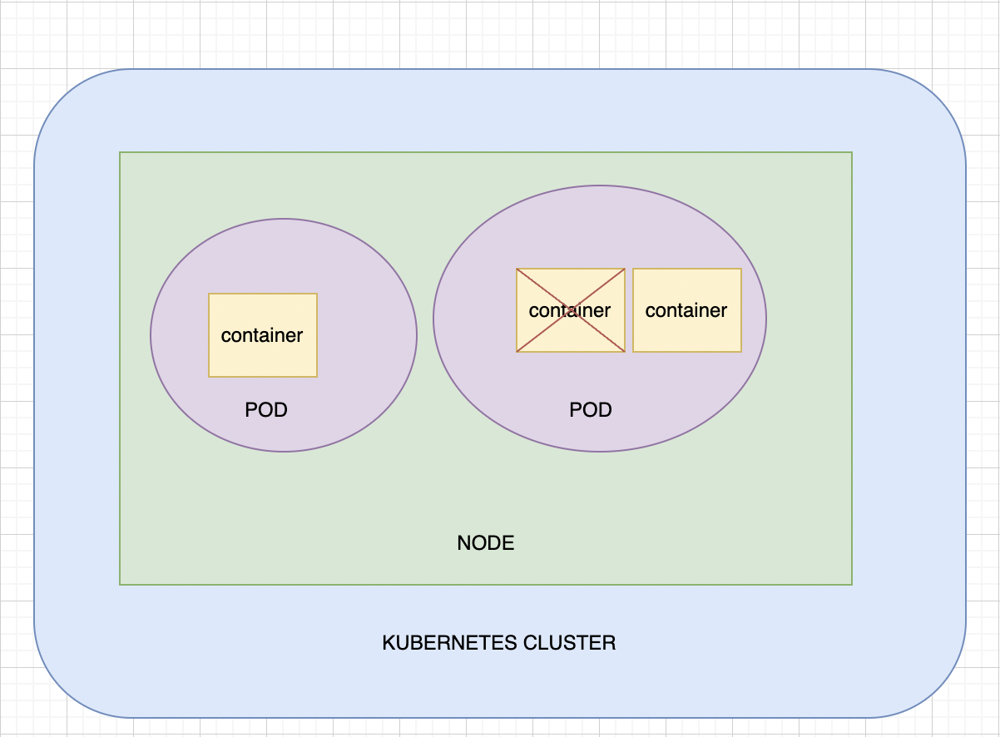
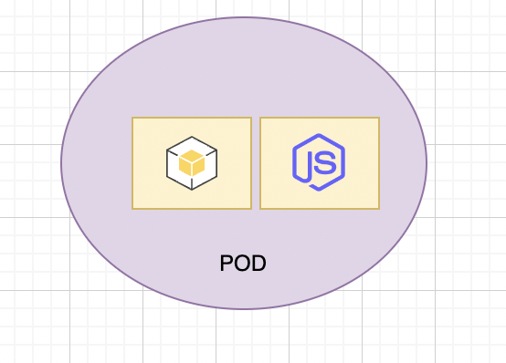

# Naming convention
**Node** - A machine where k8s is installed

**Worker node** - Where containers are launched by k8s

**Cluster** - a set of nodes grouped together

**Master node** - A node with k8s installed and configured as master
 - **Role of Master node -** 
	 - Responsible to manage the cluster
	 - Stores the information of the members of the cluster
	 - Monitor the nodes
	 - When a node fails, move the workload of the failed node to another worker node
 - The master watches over the nodes in the cluster and is responsible for the actual orchestration of containers on the worker nodes.
* * *

# Components
1. API server 
3. Controller
4. Scheduler
5. kubelet
6. Container runtime
7. etcd server

## API Server
- Acts as a front end for k8s
- The users, management devices, command-line interfaces, all talk to the API server to interact with the Kubernetes cluster.

## Etcd server
- The datastore of Kubernetes
- Etcd is a distributed, reliable key value store
- Store all data used to manage the cluster.
- Think of it this way, when you have multiple nodes and multiple masters in your cluster, etcd stores all that information on all the nodes in the cluster in a distributed manner.
- Etcd is responsible for implementing locks within the cluster to ensure that there are no conflicts between the masters.

## Scheduler
- Responsible for distributing works or containers across multiple nodes
- It looks for newly created containers and assigns them to nodes.

## Controller ( The Brain)
- Responsible for watching nodes or containers or any endpoint and responding when they goes down byt bringing up new containers

## Container Runtime
- The container runtime is the underlying software that is used to run containers. Like Docker or CRI-O

## Kubelet (Agent)
- Runs on each node in the cluster
- Responsible for making sure the containers are running on the nodes as expected

# Master Vs. Worker Nodes

# POD
K8s does not deploy container directly on the worker nodes
The containers are encapsulated into a k8s object caled POD
A POD is a single instance of an application

Simplest case - A single node K8s cluster with a sngle instance of your application

**Scaling PODs** 
*NOTE*: Containers are scaled at POD level. Meaning if you want to bring up another instance of your application then you need to bring up another POD with a container runing you code inside. You cannot* (well you can, but there are some restrictions) spin up another container inside the same POD. So basically 1 POD ~ 1 container

**Multiple containers in a POD** - There can be multiple containers inside a POD only if the containers are NOT of the same kind. Which means, you can have multiple contaniners inside a POD but not duplicate application. So one can be your main app and the other container can be your helper app (eg. used for data pre-processing) inside a same POD. For example we have a python container, which is our main app, and a JavaScript container, which is our helper app, running inside the same POD.

So basically POD is a logical grouping of containers but we rarely use multiple containers inside a POD. All the containers are created and destroyed at the same time the POD is created/destroyed.

# Kubectl
## Deploying the PODs

To deploy our apps we use `kubectl` command. This command first creates a POD and then deploys an instance of the app that we want to run.
- `kubectl run nginx --image nginx`  - This command by default downloads the image from **docker hub**. You can configure where to look for images so you can point to any other public repository.

