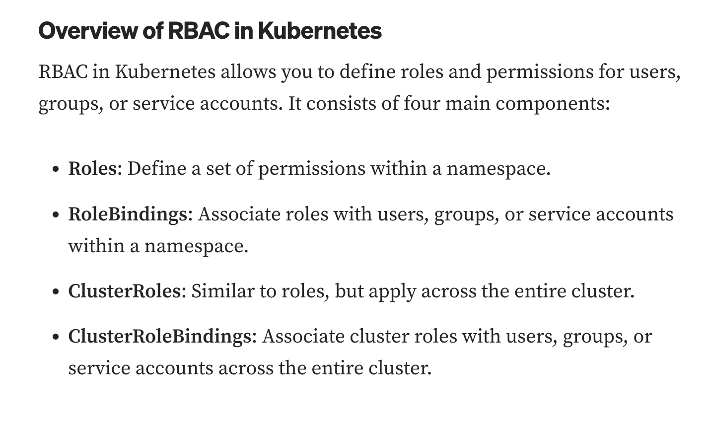
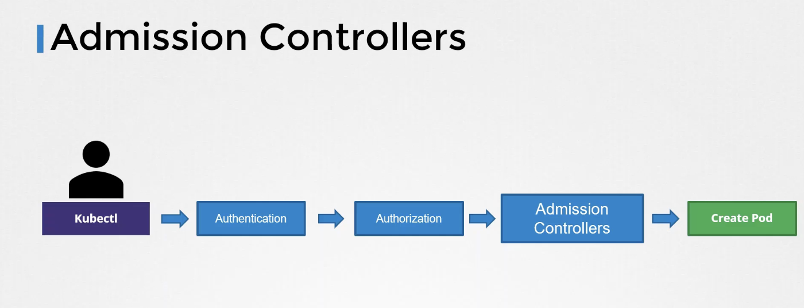
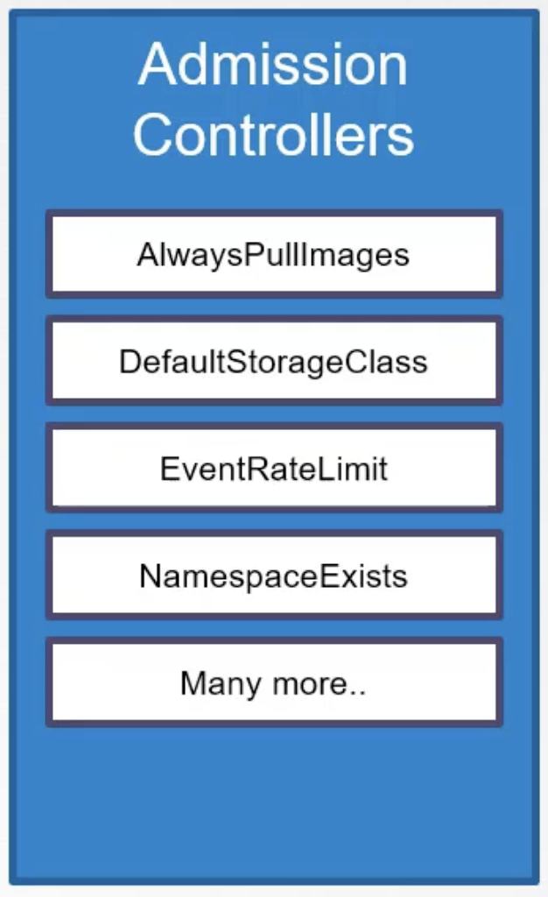

# Types of authorizations
- Node based auth
- Attribute based authorization (ABAC)
- Role-based authorization (RBAC)
- Webhook
- AlwaysAllow
- AlwaysDeny

## Checking access
`kc auth can-i create deployments`
`kc auth can-i delete nodes`
`kc auth can-i create deployments --as jane`
`kc auth can-i delete notes --as jane --namespace test`
` kc auth can-i list pods`
```
controlplane ~ ➜  kc auth can-i list pods 
yes

controlplane ~ ➜  kc auth can-i list pods --as dev-user
no
```


***

# RBAC


The main components of RBAC are following
1. Role
2. ClusterRole
3. RoleBinding
4. ClusterRoleBinding

## Role
- Role is a set of rules that defines set of permissions (get, list, create, etc.) within specific NAMESPACE  
- Role is used to grant or restrict access to API objects like Pods, ConfigMap, Services, Deployments etc.
 
### Creating a role definition file
```
apiVersion: rbac.authorization.k8s.io/v1
kind: Role
metadata:
  namespace: default
  name: pod-reader
rules:
- apiGroups: [""] # "" indicates the core API group
  resources: ["pods"]
  verbs: ["get", "watch", "list"]
- apiGroups: [""]
  resources: ["ConfigMap"]
  verbs: ["create"]
```

## ClusterRole
- Similar to Roles, Cluster role is a set of rules that defines set of permissions but are **NOT NAMESPACE specific**.
- Used to grant or restrict access to the resources that span across multiple namespaces or entire cluster

## RoleBindings
- A RoleBinding binds a Role or a ClusterRole to one or more users, groups, or service account. 
- A role binding grants the permissions defined in a role to a user or set of users
- It holds a list of subjects (users, groups, or service accounts), and a reference to the role being granted.
- **Namespace specific** 
```
apiVersion: rbac.authorization.k8s.io/v1
# This role binding allows "jane" to read pods in the "default" namespace.
# You need to already have a Role named "pod-reader" in that namespace.
kind: RoleBinding
metadata:
  name: read-pods
  namespace: default
subjects:
# You can specify more than one "subject"
- kind: User
  name: jane # "name" is case sensitive
  apiGroup: rbac.authorization.k8s.io
roleRef:
  # "roleRef" specifies the binding to a Role / ClusterRole
  kind: Role #this must be Role or ClusterRole
  name: pod-reader # this must match the name of the Role or ClusterRole you wish to bind to
  apiGroup: rbac.authorization.k8s.io
```

- Check the details of Role Binding
` kc descrie rolebinding jane-read-pods-binding` 
- You can go one level down and allow access to specific resources alone by adding `resourceNames` in the role-definition file
```
apiVersion: rbac.authorization.k8s.io/v1
kind: Role
metadata:
  namespace: default
  name: pod-reader
rules:
- apiGroups: [""] # "" indicates the core API group
  resources: ["pods"]
  verbs: ["get", "watch", "list"]
  resourceNames: ["blue-pods", "green-pods"] // her we are restricting user from accessing red pods.
```

## ClusterRoleBindings
- SImilar to RoleBinding, ClusterRoleBinding binds clusterRole to one or more users, groups, or service account but it applies the permissions across entire cluster.


## Applying the RBAC Configuration
Ref: https://medium.com/@extio/demystifying-kubernetes-rbac-a-deep-dive-into-role-based-access-control-b3fc5969794a

Once the Roles and RoleBindings are defined, you can apply the RBAC configuration using the kubectl apply command:
```
kubectl apply -f developer-role.yaml
kubectl apply -f operator-role.yaml
kubectl apply -f developer-rolebinding.yaml
kubectl apply -f operator-rolebinding.yaml
```


## Checking the Authorization mode configured on the node
```
controlplane ~ ➜  kc describe pods kube-apiserver-controlplane -n kube-system | grep authorization-mode
      --authorization-mode=Node,RBAC

controlplane ~ ➜  
```

# Admission Controllers
- If you want to do more than just authorization, for example, if we want to restrict certain images being used in the pods then we cannot achieve this with just authorization. For this we need to use Admission controllers.
 
 
 
 
 ## View enabled admission controllers
 - If you are using kube-ADM based setup then you must run the command inside kube-apiserver-controlplane pod inside kube-system namespace
 ```
 controlplane ~ ➜  k get pods -n kube-system | grep kube-apiserver-controlplane
kube-apiserver-controlplane            1/1     Running   0          10m
 ```
 
 - Exec into the kube-apiserver-controlplane pod
 ```
 controlplane ~ ➜  k exec kube-apiserver-controlplane -n kube-system -- kube-apiserver -h | grep enable-admission
      --admission-control strings              Admission is divided into two phases. In the first phase, only mutating admission plugins run. In the second phase, only validating admission plugins run. The names in the below list may represent a validating plugin, a mutating plugin, or both. The order of plugins in which they are passed to this flag does not matter. Comma-delimited list of: AlwaysAdmit, AlwaysDeny, AlwaysPullImages, CertificateApproval, CertificateSigning, CertificateSubjectRestriction, ClusterTrustBundleAttest, DefaultIngressClass, DefaultStorageClass, DefaultTolerationSeconds, DenyServiceExternalIPs, EventRateLimit, ExtendedResourceToleration, ImagePolicyWebhook, LimitPodHardAntiAffinityTopology, LimitRanger, MutatingAdmissionWebhook, NamespaceAutoProvision, NamespaceExists, NamespaceLifecycle, NodeRestriction, OwnerReferencesPermissionEnforcement, PersistentVolumeClaimResize, PersistentVolumeLabel, PodNodeSelector, PodSecurity, PodTolerationRestriction, Priority, ResourceQuota, RuntimeClass, SecurityContextDeny, ServiceAccount, StorageObjectInUseProtection, TaintNodesByCondition, ValidatingAdmissionPolicy, ValidatingAdmissionWebhook. (DEPRECATED: Use --enable-admission-plugins or --disable-admission-plugins instead. Will be removed in a future version.)
      --enable-admission-plugins strings       admission plugins that should be enabled in addition to default enabled ones (NamespaceLifecycle, LimitRanger, ServiceAccount, TaintNodesByCondition, PodSecurity, Priority, DefaultTolerationSeconds, DefaultStorageClass, StorageObjectInUseProtection, PersistentVolumeClaimResize, RuntimeClass, CertificateApproval, CertificateSigning, ClusterTrustBundleAttest, CertificateSubjectRestriction, DefaultIngressClass, MutatingAdmissionWebhook, ValidatingAdmissionPolicy, ValidatingAdmissionWebhook, ResourceQuota). Comma-delimited list of admission plugins: AlwaysAdmit, AlwaysDeny, AlwaysPullImages, CertificateApproval, CertificateSigning, CertificateSubjectRestriction, ClusterTrustBundleAttest, DefaultIngressClass, DefaultStorageClass, DefaultTolerationSeconds, DenyServiceExternalIPs, EventRateLimit, ExtendedResourceToleration, ImagePolicyWebhook, LimitPodHardAntiAffinityTopology, LimitRanger, MutatingAdmissionWebhook, NamespaceAutoProvision, NamespaceExists, NamespaceLifecycle, NodeRestriction, OwnerReferencesPermissionEnforcement, PersistentVolumeClaimResize, PersistentVolumeLabel, PodNodeSelector, PodSecurity, PodTolerationRestriction, Priority, ResourceQuota, RuntimeClass, SecurityContextDeny, ServiceAccount, StorageObjectInUseProtection, TaintNodesByCondition, ValidatingAdmissionPolicy, ValidatingAdmissionWebhook. The order of plugins in this flag does not matter.
 ```
 
 - Another way to look into that file is go into below file and check for --enable-admission-plugins
 ```
vim /etc/kubernetes/manifests/kube-apiserver.yaml
```

## Types of Admission Controller
1. Validating - 
	1. NamespaceExists
2.  