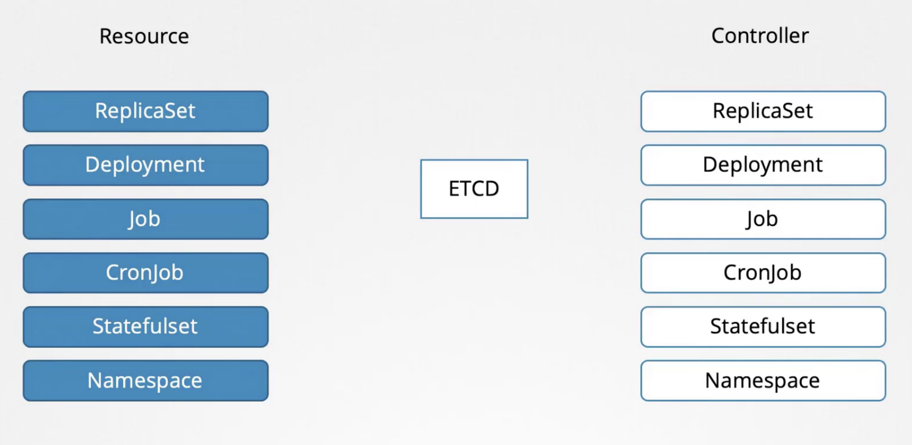
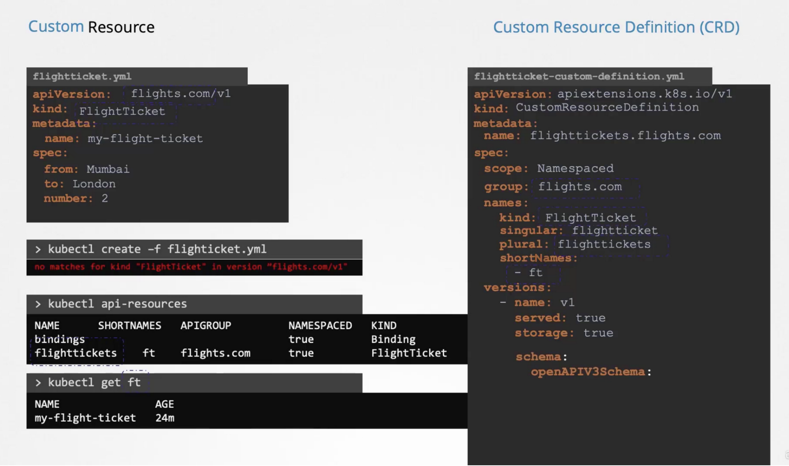
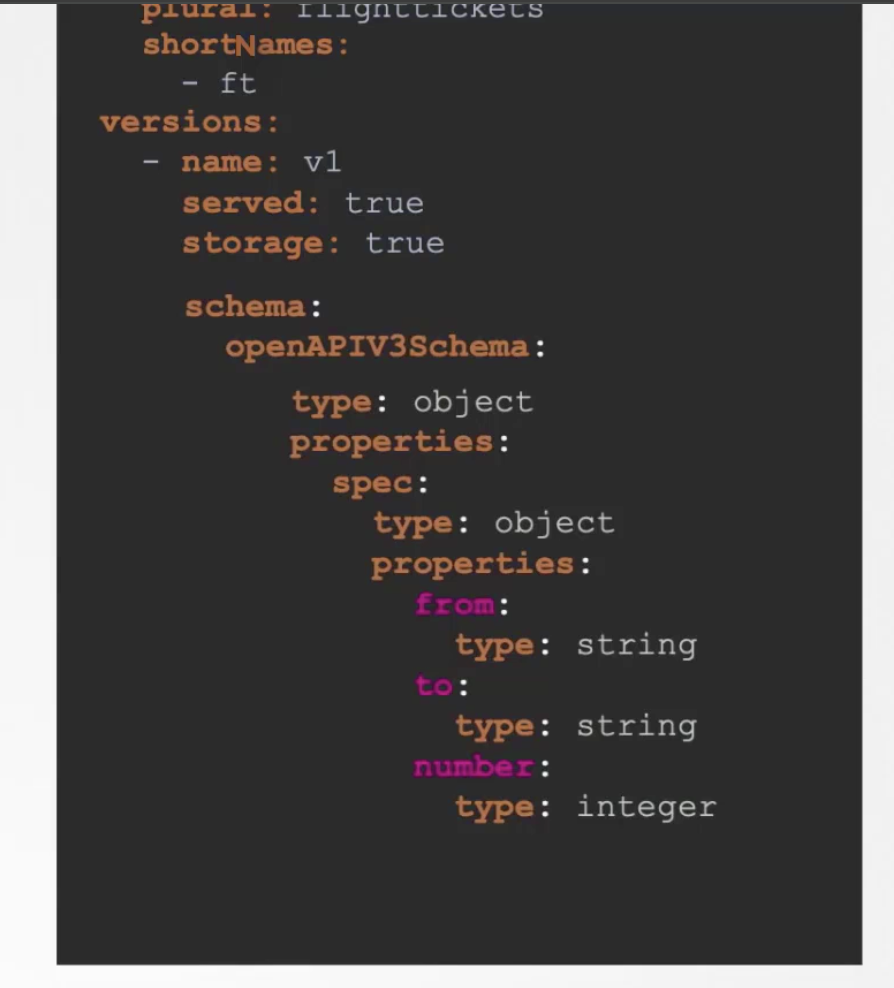

# Custom Resource Definition

## Resource
- Resource is anything that we create in k8s, like a deployment object.

## Controller
- So a controller is any process or code that runs in a loop and is continuously monitoring the Kubernetes cluster and listening to events of specific objects being changed.
- Controller is a process that monitors the status of the resource it is suppose to manage.
- it keeps monitoring when a resource is created/updated/deleted and makes changes accordingly.
- For example when a flight ticket is created, the controller's job is to actually call the booking API and make the booking.



## Creating Custom Resource
- When you create a CR you have to let k8s API know about the new resource type
- To do so, You have to create a Custom Resource Definition (CRD)
#### Custom Resource Definition
- It is similar to CR 
- The API version is apiextensions.k8s.io/v1.
- Kind is CustomResourceDefinition.
- CRDs are either namespace scopped or cluster scoped. We set this using the `scope` attribute under `spec`
	- For Namespaces scopped resources we write as `scope: Namespaced`
- Next you have to define a group for API version under spec.
- Then specify `names` for the resource. But  we must also specify a singular, plural, and shortNames versions of names. So under `names` you have `kind`, `singular`,  `plural`, and  `shortNames` 
- Then comes `versions`


- Once the CRD is written, you have to create it using `k create -f my-crd.yaml` command. Only now you are able to create CRs.
- **All this information is stored in ETCD database of k8s API.**

Some Errors
```
controlplane ~ ✖ k create -f crd.yaml 
The CustomResourceDefinition "internals.datasets.kodekloud.com" is invalid: metadata.name: 
Invalid value: "internals.datasets.kodekloud.com": must be spec.names.plural+"."+spec.group
```

This happened because the plural name was not ending with 's'. "internal" instead of "internal**s**".
```
  names:
    plural: internal
    singular: internal
    kind: Internal
```
So we changed it to `internals` and it worked
```
  names:
    plural: internals
    singular: internal
    kind: Internal
```


# Operator
# Operator Framework
- The CRD and controllers are separate entities 
- We can package them together into an operator framework.
- This can then automatically create CRDs and resources and also deploys custom controllers as a deployment.
- It can do more than that like backup & restore
- All operators are available at the operator hub.