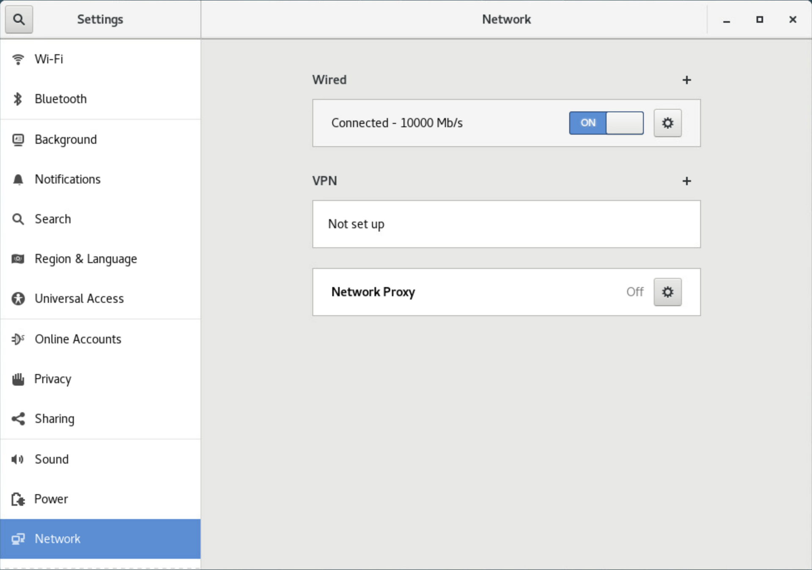
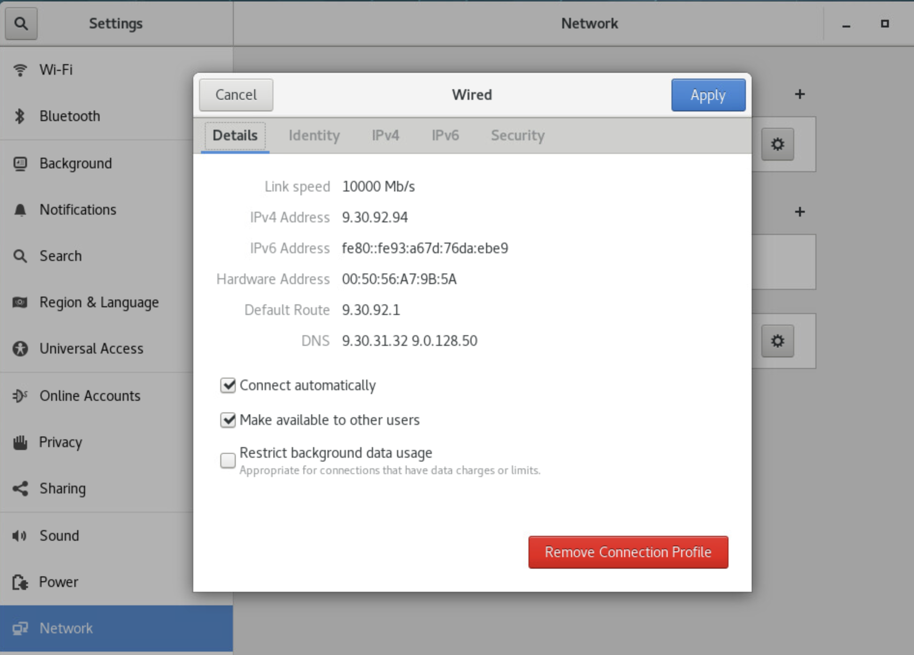
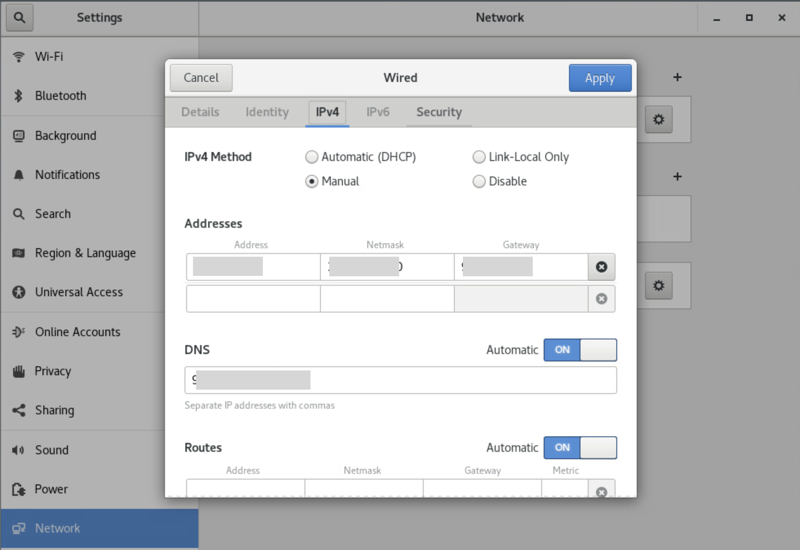

**Pre-requisite:**
* IP address
* Subnet mask
* Gateway IP
* DNS

***
- First, find the interface your box is using. In my case it is `ens192`. You can find using below command
```[root@vm592033 ~]# nmcli device status
DEVICE      TYPE      STATE      CONNECTION
ens192      ethernet  connected  ens192
virbr0      bridge    connected  virbr0
lo          loopback  unmanaged  --
virbr0-nic  tun       unmanaged  --
```

- Edit the `/etc/sysconfig/network-scripts/ifcfg-ens192` file and add following lines after `NAME=ens192`
```
DNS1=x.x.x.x
DNS2=x.x.x.x
GATEWAY=x.x.x.x
NETMASK=x.x.x
IPADDR=x.x.x.x
```

- Save and restart the network service after this
```
systemctl restart network
```

- Now go to GUI and configure the network to connect automatically
- Go to settings -> network and click on gear icon for wired one

- Click on connect automatically under details tab

- Go to IPv4 tab, select manual and add the details of your IP addresses

- Apply the configuration and reboot the box