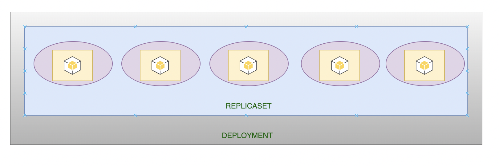
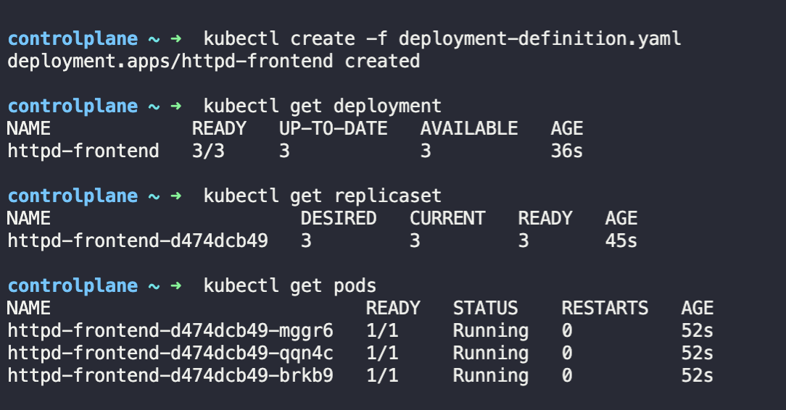
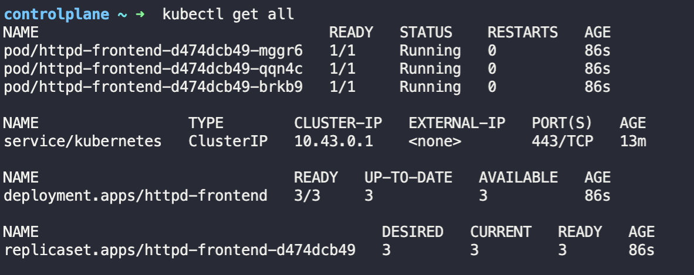

- Handles upgrading your Docker instances seamlessly as soon as the new build is available on the registry.
    
- Rolling updates - not all the pods are upgraded at once. They are upgraded one by one
    
- Each container is encapsulated in pods. Multiple such pods are deployed using replication controllers or replica sets. And then comes deployment, which is a Kubernetes object that comes higher in the hierarchy.  
    
    
- Deployment is similar to a replicaset.
    
- Deployment creates a replicaset as well
    

* * *

**Deployment definition file**

```yaml
apiVersion: apps/v1
kind: Deployment
metadata:
  name: httpd-frontend
spec:
  replicas: 3
  selector:
    matchLabels:
      name: httpd-frontend
  template:
    metadata:
      labels:
        name: httpd-frontend
    spec:
      containers:
      - name: httpd-frontend
        image: httpd:2.4-alpine
```



Output of get all comand -  


## Creating Deployment definition file

```
controlplane ~ ➜  k create deployment blue --dry-run=client -o yaml
error: required flag(s) "image" not set

controlplane ~ ✖ k create deployment blue --image=nginx --dry-run=client -o yaml
apiVersion: apps/v1
kind: Deployment
metadata:
  creationTimestamp: null
  labels:
    app: blue
  name: blue
spec:
  replicas: 1
  selector:
    matchLabels:
      app: blue
  strategy: {}
  template:
    metadata:
      creationTimestamp: null
      labels:
        app: blue
    spec:
      containers:
      - image: nginx
        name: nginx
        resources: {}
status: {}

```

## Editing a deployment

When you edit a deployment, make the changes, and save the yaml file, you don't need to apply the new changes, the deployment controller automatically updates it

```bash
kc edit deployment blue
# make changes and save and exit. No need to apply
```

## Adding labels to a deployment
- Labels are added under the metadata tag
- You cannot add labels to a deployment in an imperative way
- First create a deployment and then edit it. Once in the edit mode, add the required label under metadata.labels tag
- To check for eixisting labels in a deployment, use this command - 
```
 ➜  k get deploy my-webapp --show-labels
NAME        READY   UP-TO-DATE   AVAILABLE   AGE     LABELS
my-webapp   2/2     2            2           2m28s   app=my-webapp,tier=frontend
```