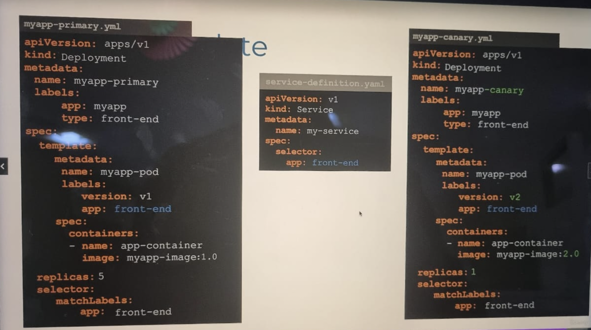

# Rolling updates and rollbacks in deployment

When a deployment is created, it triggers a rollout. A new rollout creates a new deployment revision.  
When you upgrade your application, a new rollout is triggered and a new deployment revision is created.

## Two strategies

1.  Recreate
2.  Rolling updates

**Recreate**  
In this strategy, we destroy all the pods under the deployment then recreates them all.  
The drawback here is there is downtime after objects are destroyed until the time when they are back up.

**Rolling updates** (default k8s strategy)  
Here, we don't destroy all the objects, instead we go one by one. We bring down an object and create a newer version of that object. This way, the application never goes down and the upgrade is seamless.

## How do we upgrade

If we are using a deployment definition file, we make the required changes, for eg. changing `image: nginix` to `image: nginix:2.5.7`, then we use the `apply` command.

```
k apply -f deployment-def.yaml
```

You can checck the events from deployment using describe command to check the strategy used and how things work.

```
k describe deployment myapp-deployment
```

Let's look at how a deployment performs an upgrade under the hood. When a new deployment is created, say, to deploy five replicas, it first creates a replica set automatically, which in turn creates the number of PODs required to meet the number of replicas. When you upgrade your application, as we saw in the previous slide, the Kubernetes deployment object creates a new replica set under the hood and starts deploying the containers there, at the same time taking down the PODs in the old replica set following a rolling update strategy. This can be seen when you try to list the replica sets using the kubectl get replica sets command. Here we see the old replica set with 0 PODs and the new replica set with 5 PODs.

### Check the rollout history/status

```
k rollout status deployment myapp-deployment

k rollout history deployment myapp-deployment
```

# Rollback

```
k rollout undo deployment myapp-deployment
```

The deployment will then destroy the PODs in the new replica set and bring the older ones up in the old replica set. And your application is back to its older format. When you compare the output of the kubectl get replica sets command before and after the rollback, you will be able to notice this difference. Before the rollback, the first replica set had 0 PODs and new replica set had 5 PODs, and this is reversed after the rollback is finished.

* * *

* * *

# Updating a Deployment

Here are some handy examples related to updating a Kubernetes Deployment:

## Creating a deployment, checking the rollout status and history:

In the example below, we will first create a simple deployment and inspect the rollout status and the rollout history:

```
master $ kubectl create deployment nginx --image=nginx:1.16
deployment.apps/nginx created
 
master $ kubectl rollout status deployment nginx
Waiting for deployment "nginx" rollout to finish: 0 of 1 updated replicas are available...
deployment "nginx" successfully rolled out
 
master $
 
 
master $ kubectl rollout history deployment nginx
deployment.extensions/nginx
REVISION CHANGE-CAUSE
1     <none>
 
master $
```

## Using the --revision flag:

Here the revision 1 is the first version where the deployment was created.

You can check the status of each revision individually by using the --revision flag:

```
master $ kubectl rollout history deployment nginx --revision=1
deployment.extensions/nginx with revision #1
 
Pod Template:
 Labels:    app=nginx    pod-template-hash=6454457cdb
 Containers:  nginx:  Image:   nginx:1.16
  Port:    <none>
  Host Port: <none>
  Environment:    <none>
  Mounts:   <none>
 Volumes:   <none>
master $ 
```

## Using the --record flag:

You would have noticed that the "change-cause" field is empty in the rollout history output. We can use the --record flag to save the command used to create/update a deployment against the revision number.

```master
deployment.extensions/nginx image updated
master $master $
 
master $ kubectl rollout history deployment nginx
deployment.extensions/nginx
 
REVISION CHANGE-CAUSE
1     <none>
2     kubectl set image deployment nginx nginx=nginx:1.17 --record=true
master $
```

You can now see that the change-cause is recorded for the revision 2 of this deployment.

Let's make some more changes. In the example below, we are editing the deployment and changing the image from nginx:1.17 to nginx:latest while making use of the --record flag.

```
master $ kubectl edit deployments. nginx --record
deployment.extensions/nginx edited
 
master $ kubectl rollout history deployment nginx
REVISION CHANGE-CAUSE
1     <none>
2     kubectl set image deployment nginx nginx=nginx:1.17 --record=true
3     kubectl edit deployments. nginx --record=true
 
 
 
master $ kubectl rollout history deployment nginx --revision=3
deployment.extensions/nginx with revision #3
 
Pod Template: Labels:    app=nginx
    pod-template-hash=df6487dc Annotations: kubernetes.io/change-cause: kubectl edit deployments. nginx --record=true
 
 Containers:
  nginx:
  Image:   nginx:latest
  Port:    <none>
  Host Port: <none>
  Environment:    <none>
  Mounts:   <none>
 Volumes:   <none>
 
master $
```

## Undo a change:

Lets now rollback to the previous revision:

```
controlplane $ kubectl rollout history deployment nginx
deployment.apps/nginx 
REVISION  CHANGE-CAUSE
1         <none>
3         kubectl edit deployments.apps nginx --record=true
4         kubectl set image deployment nginx nginx=nginx:1.17 --record=true
 
 
 
controlplane $ kubectl rollout history deployment nginx --revision=3
deployment.apps/nginx with revision #3
Pod Template:
  Labels:       app=nginx
        pod-template-hash=787f54657b
  Annotations:  kubernetes.io/change-cause: kubectl edit deployments.apps nginx --record=true
  Containers:
   nginx:
    Image:      nginx:latest
    Port:      <none> 
    Host Port:  <none>
    Environment: <none>       
    Mounts:     <none>
  Volumes:      
 
controlplane $ kubectl describe deployments. nginx | grep -i image:
    Image:        nginx:1.17
 
controlplane $
```

With this, we have rolled back to the previous version of the deployment with the image = nginx:1.17.

```
controlplane $ kubectl rollout history deployment nginx --revision=1
deployment.apps/nginx with revision #1
Pod Template:
  Labels:       app=nginx
        pod-template-hash=78449c65d4
  Containers:
   nginx:
    Image:      nginx:1.16
    Port:       <none> 
    Host Port:  <none>
    Environment: <none>     
    Mounts:     <none>
  Volumes:      
 
controlplane $ kubectl rollout undo deployment nginx --to-revision=1
deployment.apps/nginx rolled back
```

To rollback to specific revision we will use the --to-revision flag.  
With --to-revision=1, it will be rolled back with the first image we used to create a deployment as we can see in the rollout history output.

```
controlplane $ kubectl describe deployments. nginx | grep -i image:
Image: nginx:1.16
```

# Other Strategies

## Blue Green Strategy

- First we bring up our new deployment
- We perform some tests to make sure the application is working as expected
- We route the traffic to our new deployment at once
- To do this we use the label set on the service definition. (v1 to v2)

## Canary

- In this strategy we, just like the Blue Green strategy, we create an upgraded deployment and give it a same label as the original one.
- Since the label is same, the serivce will route the traffic equally to both the deployments. (It is a property of service to route traffic equally between the existing pods)
- To route minimal amout of traffic to the canary deployment, we simply reduce the number of pods running in the canary deployment.
- We do this by modifying the number if replicas in the canary deoployment. We set it to minimum ideally (i.e, 1 replica)
- Disadvantage is we cannot specify in percentage as to how much amount of traffic we want to route to canary.

