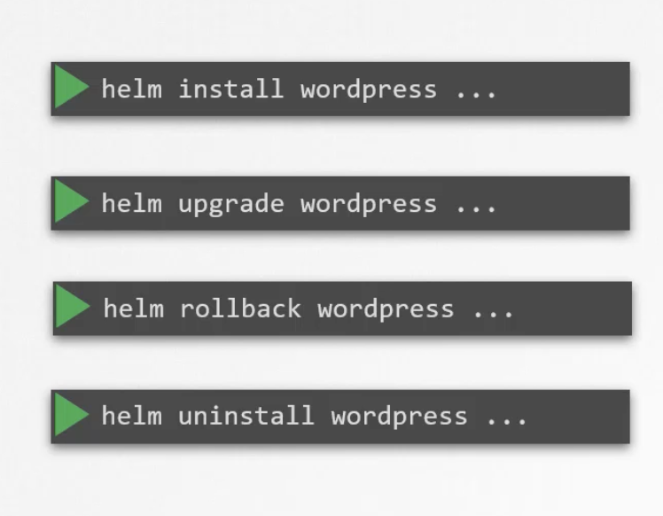
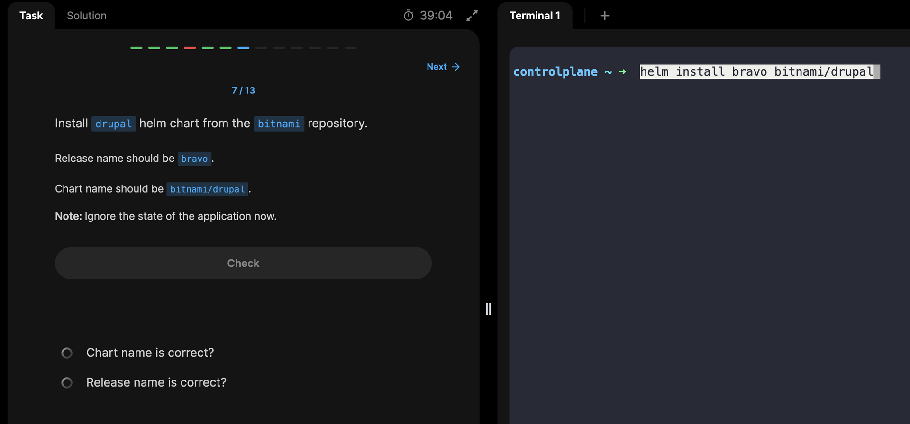
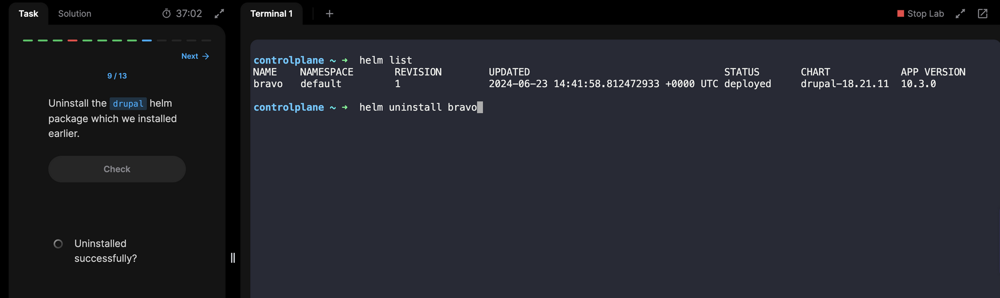
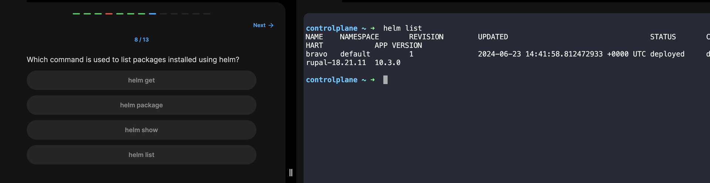
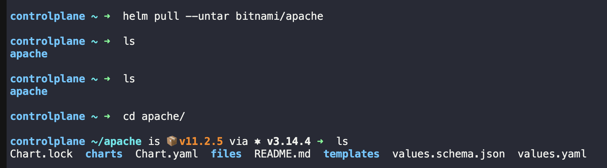
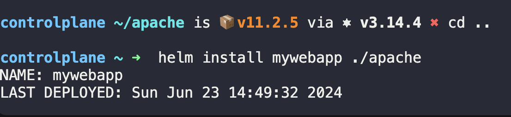

- Helm is like a package manager for k8s

## Helm concept
- Helm is used as package manager for k8s
- It knows what all objects belong to a project and can help us in managing (In case you want to delete the project you would have to manually go check and delete every related object. This can be tedious and some objects can be left unnoticed)

## Helm chart
- Inside any definition file we can add jinja templates so that we can use the same definition file for multiple projects
- Helm chart = values.yaml + templates
- It also has cart.yaml which contains metadata about the chart itself

## Helm commands
- helm list
	- Find out how many helm repo are installed
		- `helm repo list`
- helm uninstall my-release
- `helm pull --untar bitnami/wordpress` ( only to download and not install)
- Command to search specific charts on Artifact Hub.
	- 	 `helm search hub chart-name` 
	- 	 Note: Replace the chart-name with the original name.
	- 	 `helm search repo joomla`

## download a package and install afterwards

