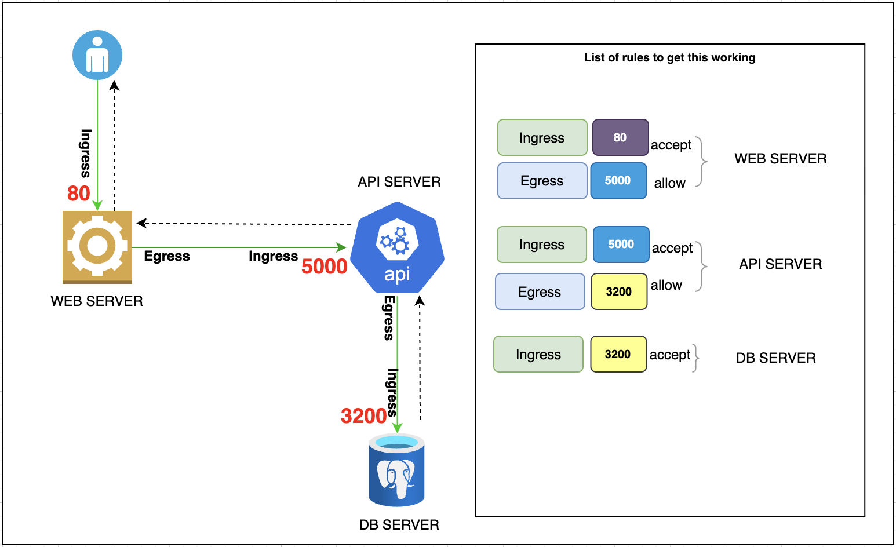

Ingress  is the incoming traffic to a service
Egress is the outgoing traffic from a service to another service for further processing

## Basic flow 

### So for above architecture to work, we will need 5 rules

1.  An Ingress rule to accept traffic on port 80 on Web server
2.  An Egress rule to allow traffic on port 5000 to API server
3.  An Ingress rule to accept traffic on port 5000 on Web server
4.  An Egress rule to allow traffic on port 3200 to DB server
5.  An Ingress rule to accept traffic on port 80 on DB server