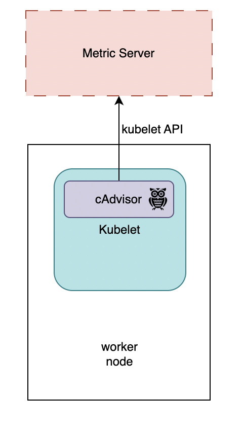

# Nodes
## Top command
```
controlplane ~ ➜  k top nodes
NAME           CPU(cores)   CPU%   MEMORY(bytes)   MEMORY%   
controlplane   307m         0%     1082Mi          0%        
node01         250m         0%     315Mi           0%  
```

### sort by cpu
```
controlplane ~ ➜  kubectl top node --sort-by='cpu' --no-headers
controlplane   240m   0%    1188Mi   0%    
node01         21m    0%    313Mi    0%
```

### sort by  memory
```
controlplane ~ ➜  kubectl top node --sort-by='memory' --no-headers 
controlplane   235m   0%    1080Mi   0%    
node01         25m    0%    301Mi    0%    
```

# Pods
## Top command
```
controlplane ~ ➜  k top pods
NAME       CPU(cores)   MEMORY(bytes)   
elephant   16m          32Mi            
lion       1m           18Mi            
rabbit     113m         253Mi 
```

### sort by memory
```
controlplane ~ ➜  k top pods --sort-by="memory"
NAME       CPU(cores)   MEMORY(bytes)   
rabbit     115m         253Mi           
elephant   16m          32Mi            
lion       1m           18Mi            
```

### sort by cpu
```
controlplane ~ ➜  kubectl top pod --sort-by='cpu' --no-headers
rabbit     114m   253Mi   
elephant   16m    32Mi    
lion       1m     18Mi    
```
