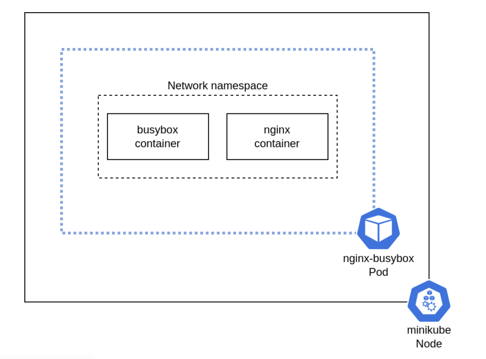

## Simplest multi container pod definition
```
apiVersion: v1
kind: Pod
metadata:
  name: checkme
spec:
  containers:
    - name: frontend
      image: nginx
    - name: backend
      image: redis                 
```
## Find Container names
```
controlplane $ k get pods checkme  -o json | jq [.spec.containers[].name]
[
  "frontend",
  "backend"
]
```

##  Exec into required container
```
k exec -it checkme -c frontend -- /bin/bash
k exec -it checkme -c backend -- /bin/bash
```

## Architecture of multi container pods
Each container shares the same network namespace. So they can communicate over localhost with each other



## Cehck status of containers
```
kubectl get pod -o json checkme | jq .status.containerStatuses[] ``` 