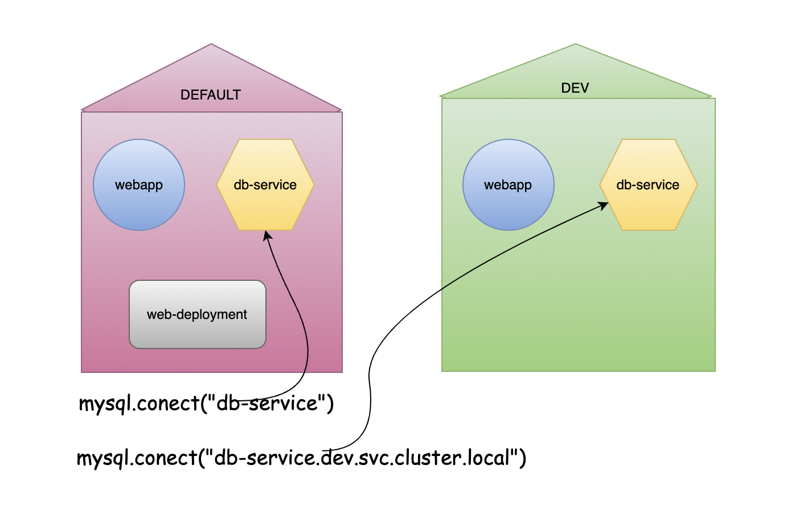

**DNS Explanation**


## Creating a namespace
- By using Yaml definition file
```yaml
apiVersion: v1
kind: Namespace
metadata:
	name: dev
```

 `kubectl create -f namespace-definition.yaml` 
 
- By using command
	- `kubectl create namespace dev` 
* * *
## Using namespaces in commands -
`kubectl create -f pod-definition.yaml --namespace=dev`
This command creates the pod in teh dev namespace. If not provided, it creates under Default namespace.

We can add the namespace attribute in the definition file to make sure the object gets created only under that namespace. We add that under metadata section like `namespace: dev`
```yaml
apiVersion: v1
kind: Pod
metadata:
	name: myapp-pod
	namespace: dev
	labels:
		name:myapp
		type: frontend
spec:
	containers:
		- name: myapp-container
		  image: nginx
```
* * *
## Setting default namespace to other than Default
`kubectl config set-context --current --namespace=dev`
This will make 'dev' the default namespace for all future kubectl commands

## Limiting Resources in a namespace
Refer [Resource Quota](../Kubernetes%20CKAD/Resource%20Quota.md)

## Checking available namespaces
`kc get namespaces`
`kc get ns`
`kubectl get ns --no-headers`

## Listing objects in all namespaces
`kubectl get pods --all-namespaces`
`kc get pods -A`

## Listing objects in a specific namespace
`kubectl get pods --namespace=dev`
`kc get pods -n=dev`
