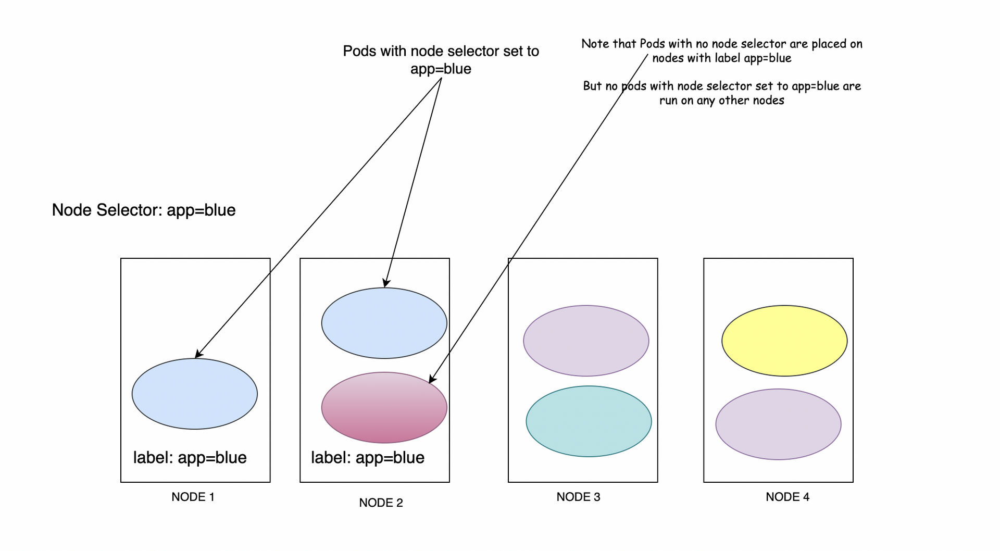

***Use to restrict that pods are placed on particular nodes only. If the node with matching label is not found, the pod will NOT be scheduled*** 


- This is used to make sure we run the pods on certain nodes only. Unlike taints, here the pods will always go into the nodes with matching labels.
- If the matching label is not found, the pod will not be scheduled
- For this we have to first label the nodes
- Labelling is same as tainting - it is a `key=value` pair
```
kc label nodes node01 size=large
```
- Next we have to use this label inside pod definition file to make sure our pod is always schedules on that particular node
- For this we use nodeSelector parameter
```
apiVersion: v1
kind: Pod
metadata:
	name: mypod
spec:
	containers:
		- name: nginx-container
			image: nginx
	nodeSelector:
		size: large
```

Note: unlike tolerations, where we use the key, operator, value, effect parameters here we simply make use of key_name: value_name

## Multiple labels
We can apply many labels to a single node. Just run the label node command multiple times with the label we want
```
kc label nodes node01 color=blue
kc label nodes node01 os=linux
kc label nodes node01 ou=ibm
```
## Checking labels
```bash
kubectl get nodes --show-labels
```

Another way is to use describe node command
```bash
controlplane ~ ➜  k describe nodes node01 | grep -A7 Labels
Labels:             color=blue
                    os=linux
					ou=ibm
Annotations:        flannel.alpha.coreos.com/backend-data: {"VNI":1,"VtepMAC":"5e:e8:6e:43:d3:9b"}
```

## Note
- Any other pods that doesn't have any node selector set can be placed on any node irrespective of the label set on that node. This is because nodes can have multiple labels


## Drawbacks
We cannot use complex logic here. For eg. if we want to place our pods on any node that is not small in size or many others like - 
- size is not small
- size is medium or large

We cannot do this using nodeSelector. We use [Node Affinity](../Kubernetes%20CKAD/Node%20Affinity.md) for this.

