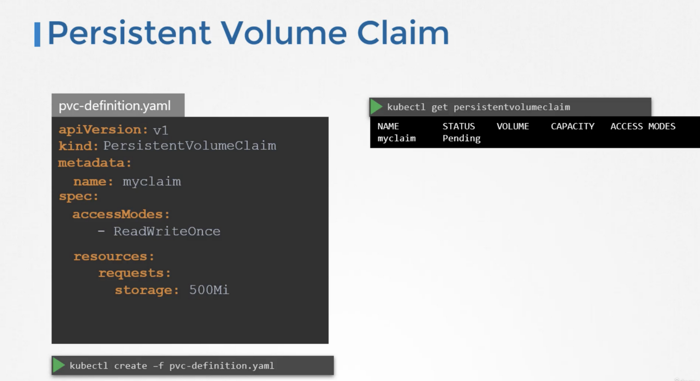
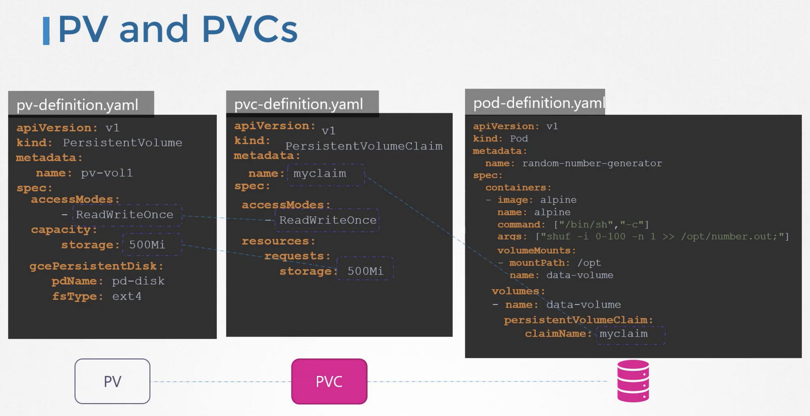
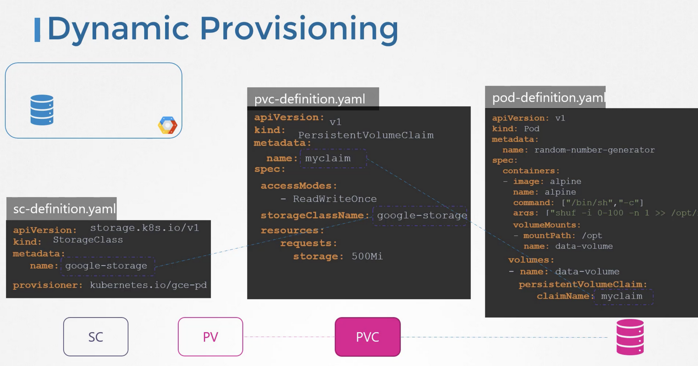
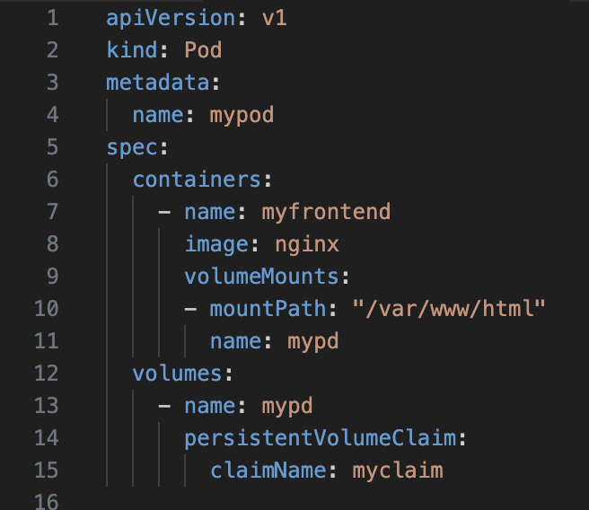
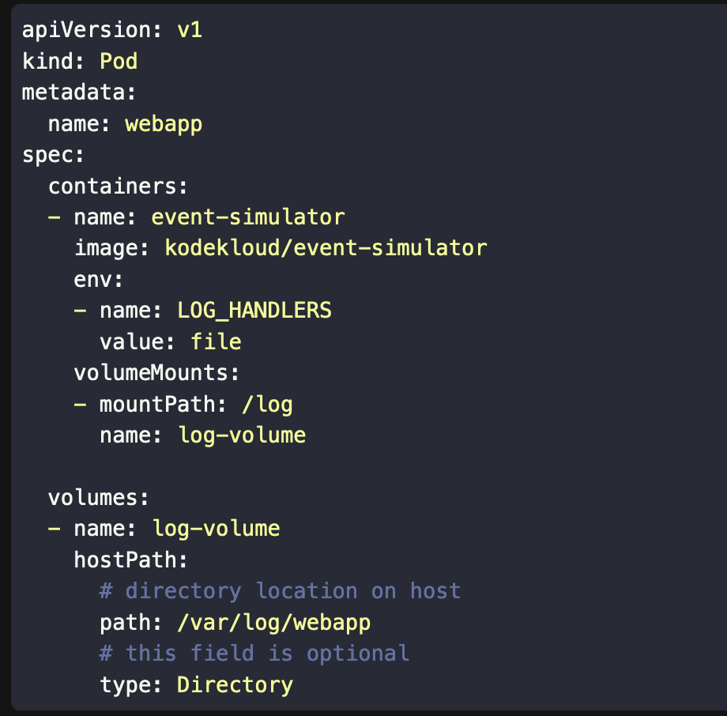

\`\`# PV

A persistent volume is a cluster wide pool of storage volumes, configured by an administrator to be used by users deploying applications on the cluster.  
The users can now select storage from this pool using persistent volume claims.

- It has three main things to be written under spec
    - 1.  capacity
    - 2.  access mode
    - 3.  type of PV ( AWS/ Gluster etc)
- Apart from those three there are many like `storageClassName`

```
apiVersion: v1
kind: PersistentVolume
metadata:
  name: foo-pv
spec:
  storageClassName: manual
  accessModes: 
  	- ReadWriteOnce (or ReadWriteMany)
    capacity:
        storage: 1Gi
    
    hostPath: (this is the volume type)
        path: /tmp/data

```

# PVC

- Once the persistent volume claims are created, Kubernetes binds the persistent volumes to claims based on the request and properties set on the volume.
- Every persistent volume claim is bound to a single persistent volume.
- During the binding process, Kubernetes tries to find a persistent volume that has sufficient capacity as requested by the claim, and any other request properties, such as access modes, volume modes, storage class, et cetera.
- You can use labels and selectors to use a specific PV for your PVC
- There is a one-to-one relationship between claims and volumes.
- If there are no volumes available, the persistent volume claim will remain in a pending state until newer volumes are made available to the cluster. Once newer volumes are available, the claim would automatically be bound to the newly available volume.  
    

## Static Provisioning



## Dynamic Provisioning



\- It is caled dynamic provisioning because in the storage class object we have used the `provisioner: kubernetes.io/gce-pd`. If that was something like `kubernetes.io/no-provisioner` that means there is no dynamic provisioning.

\- When you create a PVC using the SC. The PVC doesn't get bind to the PV (***remember PV is internally created by SC*)** if the binding mode of the SC is set to `WaitForFirstConsumer`. 

\- If the Storage Class makes use of `VolumeBindingMode` set to `WaitForFirstConsume`, This will delay the binding and provisioning of a PersistentVolume until a Pod using the PersistentVolumeClaim is created.

&nbsp;

# Using PVCs in Pods

Once you create a PVC use it in a POD definition file by specifying the PVC Claim name under persistentVolumeClaim section in the volumes section like this:



```
kind: Pod
metadata:
  name: mypod
spec:
  containers:
    - name: myfrontend
      image: nginx
      volumeMounts:
      - mountPath: "/var/www/html"
        name: mypd
  volumes:
    - name: mypd
      persistentVolumeClaim:
        claimName: myclaim
```

The same is true for ReplicaSets or Deployments. Add this to the pod template section of a Deployment on ReplicaSet.

## Example of a pod with normal nodes storage

```
apiVersion: v1
kind: Pod
metadata:
  name: webapp
spec:
  containers:
  - name: event-simulator
    image: kodekloud/event-simulator
    env:
    - name: LOG_HANDLERS
      value: file
    volumeMounts:
    - mountPath: /log
      name: log-volume

  volumes:
  - name: log-volume
    hostPath:
      # directory location on host
      path: /var/log/webapp
      # this field is optional
      type: Directory
```

