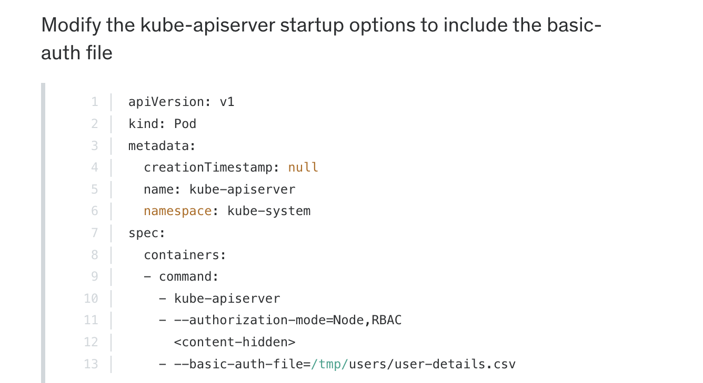

# Authentication - Cluster

## Admin users
- K8s doesn't have its own user db therefore you cannot create users directly (except Service Accounts). It uses a file/certificates/LDAP etc. 
- User access is managed by the `kube-apiserver`
- The kube-apiserver file resides here - `/etc/kubernetes/manifests/kube-apiserver.yaml`
- `kube-apiserver` handles authentication part. It uses any of the following for the same
	- 1. Static password file ( containing a list of users)
	- 2. Static Token file
	- 3. Certificates
	- 4. Identity services (like LDAP)
### Static Password file
- A csv file that has follwoing format
	- password, user-name, user-id
	- Example - 
```csv
pass1, user1, u0001
pass2, user2, u0002
pass3, user3, u0003
pass4, user4, u0004
```

- Let the api-server know of this file
	- Edit the kube-apiserver.service file. /etc/kubernetes/manifests/kube-apiserver.yaml
	- Under the ExecStart= add the option basic-auth-file like this - 
		- `-- basic-auth-file=user-details.csv`
	- Login
		- `curl -kv https://master-node-ip:6443/api/v1/pods/ -u "user1:password"`
		- 