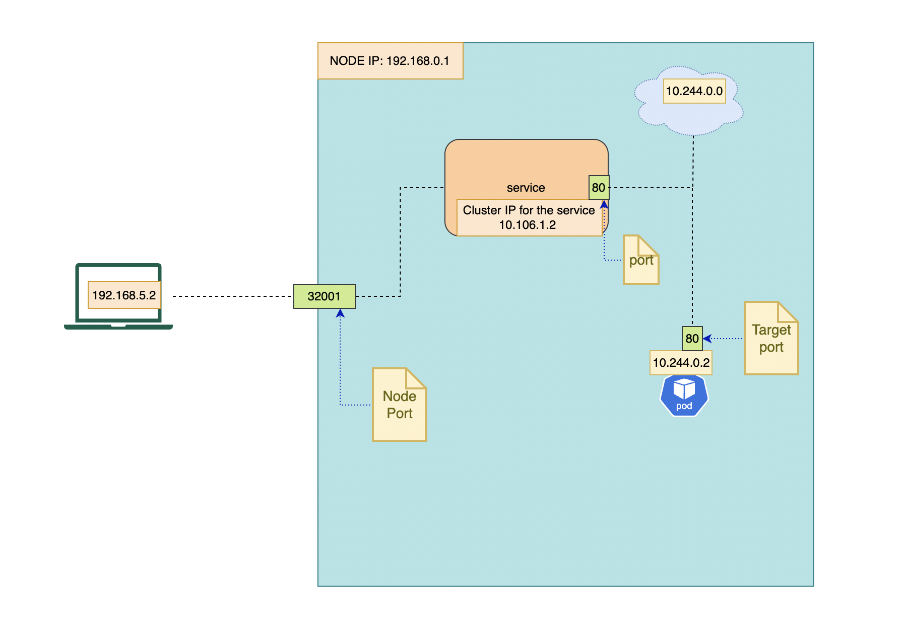
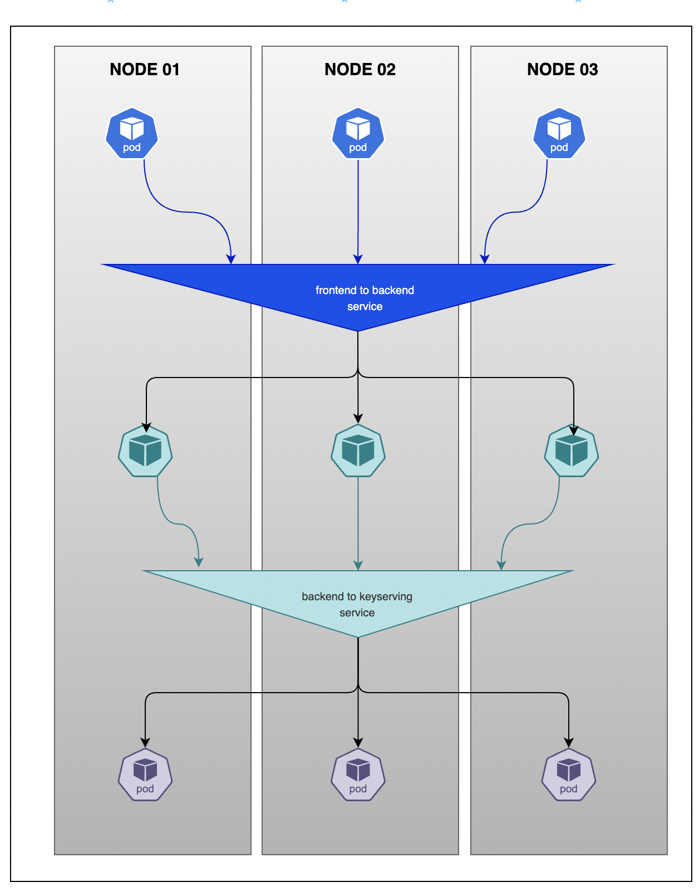

# Service
- A service is an object that allows connectivity of a pod to the outside world. 
- A service is aware of all the nodes and can redirect a request to any pod on any node if there are replicas
- A serivce has an inbuilt load balancing feature. The algorithm is randomly chosen by k8s
- It distributes the load between pods

# Types of Services
## 1. NodePort Service
- We assign a port on the node that is mapped to a pod
- The port should be in the range of 3000 to 32767
- If not specified, a random port between that range is chosen
- Each node proxies that port (the same port number on every Node) into your Service.
- For a node port Service, Kubernetes additionally allocates a port (TCP, UDP or SCTP to match the protocol of the Service). 
- Every node in the cluster configures itself to listen on that assigned port and to forward traffic to one of the ready endpoints associated with that Service.

```
apiVersion: v1
kind: Service
metadata:
  name: my-service
spec:
  type: NodePort
  selector:
    app.kubernetes.io/name: MyApp
  ports:
    - port: 80
      # By default and for convenience, the `targetPort` is set to
      # the same value as the `port` field.
      targetPort: 80
      # Optional field
      # By default and for convenience, the Kubernetes control plane
      # will allocate a port from a range (default: 30000-32767)
      nodePort: 30007
```


## 2. ClusterIP Service
- This is the **default service type**. So when you create a service and don't specify the service type, it will create a clusterIP service.
- Instead of the node port, a port is opened only on the service to enable the pods to communicate with each other. 
- For example if we have front-end, back-end, and a key-serving pods, and each of them have 3 replicas, how are they going to communicate with each other
- For this we create the clusterIP type service
- We create one for front-end to back-end communication and another for back-end to key-serving


# Networking in k8s
```
$ kubectl get pod –o wide
NAME                           READY     STATUS    RESTARTS   AGE       IP            NODE
hello-world-5b446dd74b-7c7pk   1/1       Running   0          22m       10.244.18.4   node-one
hello-world-5b446dd74b-pxtzt   1/1       Running   0          22m       10.244.3.4    node-two
----------------------------------------------------------------
$ k get pods -o wide
NAME   READY   STATUS    RESTARTS   AGE   IP           NODE           NOMINATED NODE   READINESS GATES
pod1   1/1     Running   0          58s   10.42.0.9    controlplane   <none>           <none>
pod2   1/1     Running   0          7s    10.42.0.10   controlplane   <none>           <none>
```

- In the above output, the IP column shows the internal cluster IP for each pod.