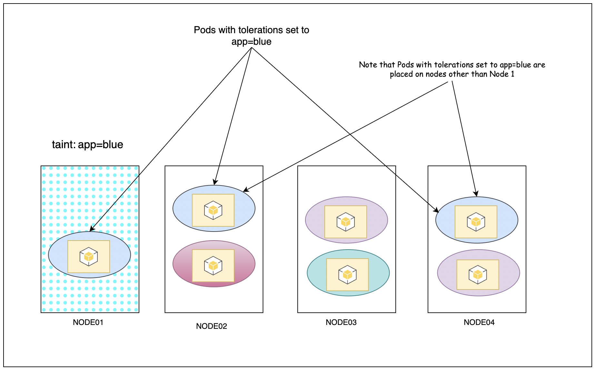
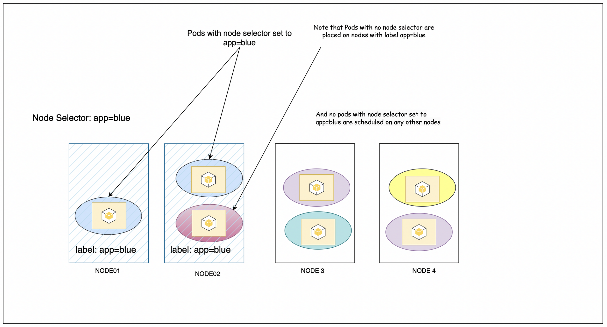

# Taints Vs Tolerants Vs NodeSelector Vs NodeAffinity

I have a lot of confusion as to which one is used when and why. To understand this, let's go back in time when we had none of these and the pods can be scheduled on any node that is picked up by scheduler. 

Let's say we are managing a cluster for two clients, client A and client B, and we don't want dedicated nodes for those clients. Let us asume we want to dedicate node01 for cleint A and node02 for cleint B. So how to make sure that pods from client A are not placed on node02 and similarly pods of client B are not placed on node01. 

To solve this issue we came up with taints. Tainting is similar to labelling a node. You taint a node so that it will only accepts certain pods. So in our example, we would like to taint node01 with client A and taint node02 with client B. To acheive this we run following command (ignore the value NoSchedule for now)
```
kubectl taint nodes node01 client=A:NoSchedule
kubectl taint nodes node02 client=B:NoSchedule
```

Now that we have applied the taint on the nodes we need some method to make the pods aware of the taints. For this, we use tolerations in the pod definition file to make pods from cleint A tolerant to the taint applied on node01 and make pods from client B tolerant to taint applied on node02. 
Example spec for pods from client A. For client B, replace the `value` with `"B"`.
```yaml
...
spec:
	tolerations:
		- key: "client"
			operator: "Equals"
			value: "A"
			effect: "NoSchedule"
...
```

When the pods are scheduled, the scheduler looks for available nodes and tries to schedule on one of the nodes. But since we have applied taint to the nodes, only the pods that are tolerant to the taint are allowed to be scheduled on that node. 

With this we achieved our purpose but what if there is one more node `node03`. In this case, the scheduler can schedule pods from any client on this third node `node03` despite the fact that we made the pods tolerant. **This is because taints only make sure that no other pods can be scheduled on the node but it does not restrict pods from being scheduled on other nodes.**
Practically you can apply taint on node03 as well so that noother pods will be scheduled on node03 but if you have hundreds of nodes then applying taints to each node is not a great idea. 


So we came up with what is called **Node Selector**. With node selector, we add a label in the pod definition file of the node that we want our pod to be scheduled on. For this we first need to label the nodes. Labelling the nodes is similar to tainting
```
kubectl label nodes node01 client=A
```
After labelling the node, we add that label in the pod definition file under spec
```yaml
...
spec: 
	nodeSelector:
		client: A
...
```
This will make sure that the pod will always be scheduled on the node with matching label i.e, `client=A`, which is node01 in our case. 

But the problem here is if we have pods which does not have any node selector set, those pods can be placed on the nodes with any label. So we can have pods from any other client running on node01.


As you can see in the above image a red pod is placed on the node that is labelled to accept app=blue. This is because a node can have multiple labels. To overcome this we have to make use of combination of the taints and tolerations and node selector. To achieve our desired state we first taint the ndoes with respective clients so that no other pod can be scheduled on those nodes. next we add node selector so that the pods are only scheduled on the desired nodes. So with node selector we made sure our pods are always scheduled on the nodes we want and to avoid other pods to be scheduled on the nodes we use taints.

But with node selector we can only use simple logic like app=frontend or size=small. What if we want to use complex logic like size = small or medium OR app= blue or green or yellow. For this we have node affinity. To achieve this we add affinity under the spec of the pod

Node affinity for size = small or medium. With the below spec the pod will be placed on any node that has label set to small or medium.
```yaml
...
spec:
	affinity:
		nodeAffinity:
			requiredDuringSchedulingIgnoredDuringExecution:
				nodeSelectorTerms:
					- matchExpressions:
						- key: size
							operator: Equals
							values:
								- small
								  medium
...
```


Node affinity for color = blue or yellow or orange
```yaml
...
spec:
		affinity:
			nodeAffinity:
				requiredDuringSchedulingIgnoredDuringExecution:
					nodeSelectorTerms:
						- matchExpressions:
							- key: color
								operator: Equals
								values:
									- blue
									  yellow
									  orange
...
```
