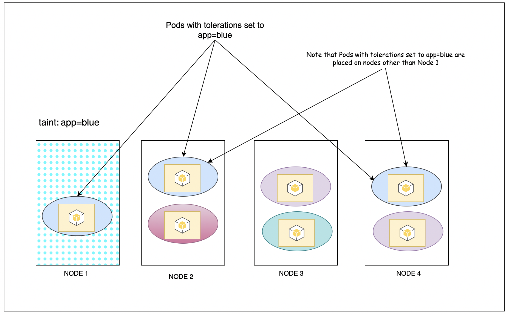

***Use to restrict what pods are placed on what nodes but it does not guarantee that tolerant pods will always be placed on that particular node*** 
To make the pods run on a specific nodes always we use [Node Selector](../Kubernetes%20CKAD/Node%20Selector.md)

- **Taints are applied on the Nodes**
- **Tolerations are applied on the Pods**

## Applying taint on the Node
```
kc taint nodes node-name key=value:taint-effect

controlplane ~ ➜  k taint nodes node01 spray=mortein:NoSchedule
node/node01 tainted
```

## Checking taint on the Nodes
```
controlplane ~ ➜  k describe nodes node01 | grep Taint
Taints:             <none>

controlplane ~ ➜  k describe nodes node01 | grep Taint
Taints:             spray=mortein:NoSchedule
```

## Removing taint on the Node
1. Get the taint that we want to remove
```
kc describe nodes <NODE_NAME> | grep Taint
```
2. Copy the value you get from the above command and use the **minus** sign to remove the taint
```
kc taint nodes nodename <TAINT_VALUE>-
```

```
controlplane $ k taint nodes node01 spray=odomos:NoSchedule
node/node01 tainted

controlplane $ k describe nodes node01 | grep Taint   
Taints:             spray=odomos:NoSchedule

controlplane $ k taint nodes node01 spray=odomos:NoSchedule-
node/node01 untainted

```

### Taint Effect 
The taint effect defines what happens to a Pod if it is not tolerant to the taint. There are three taint effects
1. **NoSchedule** - Pods will not be scheduled on that node
2. **PreferNoSchedule** - Try not to schedule on that node but can't gurrantee
3. **NoExecute** - New pods will not be scheduled and existing pods,if any, will be evicted if they do not tolerate the taint
```
kc taint nodes node1 app=blue:NoSchedule
```

## Applying tolerations to the Pod
Add the tolerations parameter under the spec of the pod definition. For eg. if we want the pod to be tolerant to the blue taint we specify it like this 
NOTE: The values under tolarations are in double quotes
```yaml
apiVersion: v1
kind: Pod
metadata:
	name: myapp-pod
spec:
	containers:
		- name: nginx-pod
			image: nginx
	tolerations:
		- key: "app"
			operator: "Equals"
			value: "blue"
			effect: "NoSchedule"
```



The master node is bydefult tainted by k8s to avoid any pods being run on the master node. Ideally we should not run pods on the master (AKA controlplane) node.
```
controlplane $ k get nodes -A
NAME           STATUS   ROLES           AGE     VERSION
controlplane   Ready    control-plane   6d17h   v1.28.4
node01         Ready    <none>          6d17h   v1.28.4

# Now I will run a pod and it will be scheduled on node01

controlplane $ k describe nodes controlplane | grep Taint
Taints:             node-role.kubernetes.io/control-plane:NoSchedule

controlplane $ k run myapp --image=nginx
pod/myapp created

controlplane $ k describe pod myapp | grep -i node
Node:             node01/172.30.2.2
Node-Selectors:              <none>
Tolerations:                 node.kubernetes.io/not-ready:NoExecute op=Exists for 300s
                             node.kubernetes.io/unreachable:NoExecute op=Exists for 300s
  Normal  Scheduled  14s   default-scheduler  Successfully assigned default/myapp to node01
```

## Drawback
- We cannot gurantee the pods will not be placed on any random node. 
- Using taints and tolerations will only make sure we don't place pods on certain nodes but pods can be scheduled on any other nodes that doesn't have any taints.
- To overcome this we have [Node Selector](../Kubernetes%20CKAD/Node%20Selector.md)