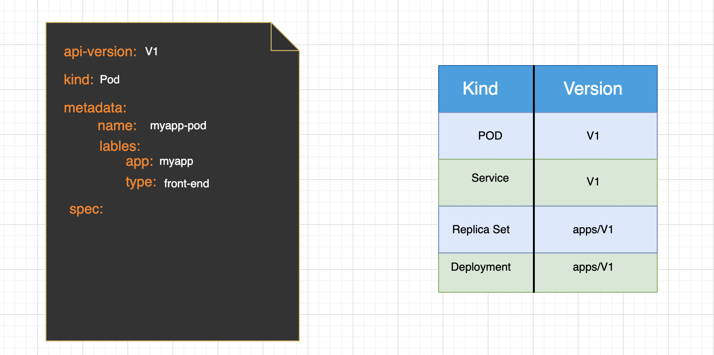
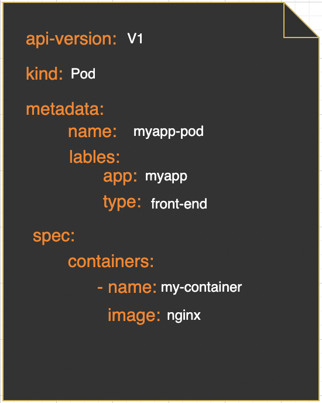

**api-version**: can be any of the values shown in the table
**Kind**: can be any of the values shown in the table

**Metadata**: Under metadata you can only provide name or lables or anything else that k8s expects. You cannot add anything of your own. But under lables, you can add anythnig you want.

**Spec:** Depends on the type of object we are creating. Here since the kind is set to POD, the spec section would contain containers as a list/array
